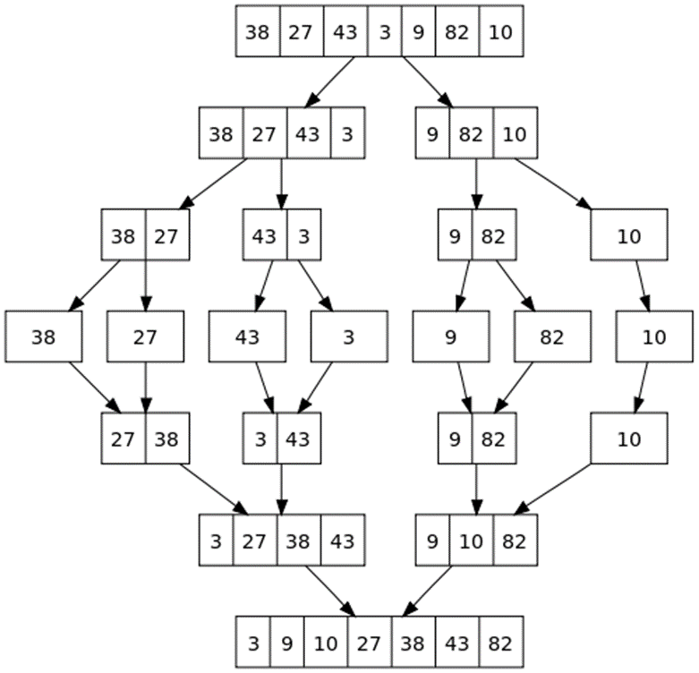

# LAB211 Assignment
```
Type: Short Assignment
Code: J1.S.P0005
LOC: 70
Slot(s):1
```
## Title
 Merge sort algorithm.
## Background Context
Merge sort takes advantage of the ease of merging already sorted lists into a new sorted list. It starts by comparing every two elements (i.e., 1 with 2, then 3 with 4...) and swapping them if the first should come after the second. It then merges each of the resulting lists of two into lists of four, then merges those lists of four, and so on; until at last two lists are merged into the final sorted list.
Of the algorithms described here, this is the first that scales well to very large lists, because its worst-case running time is O(n logn). It is also easily applied to lists, not only arrays, as it only requires sequential access, not random access. However, it has additional O(n) space complexity, and involves a large number of copies in simple implementations. Program Specifications
### Function details:
1. Display a screen to prompt users to input a positive decimal number.
   o Users run the program, display a screen to ask users to enter a positive decimal number.
   o Users input a positive decimal number. Then, perform Function 2.
2. Display & sort array.
   o Generate random integer in number range for each array element.
   o Display array before and after sorting.
### Expectation of User interface:

### Guidelines
Algorithm
Merge sort is a divide and conquer algorithm.
Steps to implement Merge Sort:

1) Divide the unsorted array into n partitions, each partition contains 1 element. Here the one element is considered as sorted.
2) Repeatedly merge partitioned units to produce new sublists until there is only 1 sublist remaining. This will be the sorted list at the end.




Merge sort is a fast, stable sorting routine with guaranteed O(n*log(n)) efficiency. When sorting arrays, merge sort requires additional scratch space proportional to the size of the input array. Merge sort is relatively simple to code and offers performance typically only slightly below that of quicksort.
