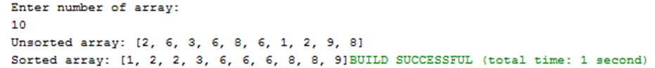

# LAB211 Assignment
```
Type: Short Assignment
Code: J1.S.P0003
LOC: 40
Slot(s):1
```
## Title
Insertion sort algorithm.
## Background Context 
Insertion sort belongs to the O(n^2) sorting algorithms. Unlike many sorting algorithms with quadratic complexity, it is actually applied in practice for sorting small arrays of data. For instance, it is used to improve quicksort routine. Some sources notice, that people use same algorithm ordering items, for example, hand of cards.
## Program Specifications
Design a program that allows users to input the number of array. Generate random integer in number range input. Display unsorted array and sorted array using insertion sort.
## Function details: 
* Display a screen to prompt users to input a positive decimal number. 
    - Users run the program, display a screen to ask users to enter a positive decimal number. 
    - Users input a positive decimal number. Then, perform Function 2.a
* Display & sort array.
    - Generate random integer in number range for each array element. 
    - Display array before and after sorting.
## Expectation of User interface:

